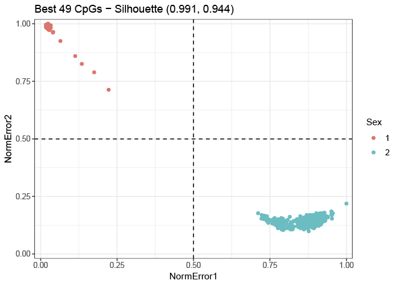

```{r setup, include = FALSE}
knitr::opts_chunk$set(
  collapse = TRUE,
  comment = "#>"
)
```

## Introduction

`EWASex` is a light-weight R-package for gender prediction based on methylation profiles sampled with the Illumina Infinum 450K Human BeadChip array.  

The package contains a main function `getPredictions`, that performs the whole set of analysis needed to perform the predictions. Additionally, more information is availabe by running the following commands after instalation: 


    ?getPredictions
    ?getMeansAndSD
    ?getGoldCpGNames
    
Data for means and standard deviation is available by running (which is used in the case of datasets that doesn't contain gender information or contain spurious gender labels):

    data(MeansAndSD49)

## Tutorials

After installing the `EWASex` (see the github page for information about this), use the following code to predict and plot the results of the typical workflow.

Prior to this step, you should have a data.frame with normalized beta.values, see the `minfi` R-package for help on how to do this is if you have RAW data.

#### Example 1 (dataset with gender labels)

Use this if you have a dataset which contains gender labels.

    library("EWASex") # load the library
    
    sex <- pheno$sex  # the vector containing your gender information
    df <- beta.values # change this to your data.frame or matrix, containing your beta values
    
    # subset to only use the 49 CpGs recommended by the package, assuming 1 CpG per column
    df <- df[,colnames(df) %in% getGoldCpGNames()]
    
    predictions <- getPredictions(genders = sex, df = df)
    
It is possible to see the output of the getPredictions function by using the `head` function. Here we also add the actual gender to the results from the phenotype file.

    predictions$Sex <- sex # add sex labels to the results for comparison
    head(predictions, 10)  # prints the top 10 table rows
    
```{r, echo=FALSE, results='asis', fig.cap='prediction output'}
precompiled_preds <- read.csv("allPredictionsForVignette.csv")
knitr::kable(head(precompiled_preds, 10))
```

We can then check the confusion matrix (see https://en.wikipedia.org/wiki/Confusion_matrix for more information).

    table(predictions[,c('predictedGender', 'Sex')])
    
To produce the following table (note in this example we only use 20 samples, which in this case has a 100% accuracy):

```{r, echo=FALSE, results='asis', fig.cap='prediction output'}
knitr::kable(table(precompiled_preds[,c('predictedGender', 'Sex')]), row.names = T)
```


Next if we want to plot the normalized errors with the actual gender information and compute the silhouette values (see https://en.wikipedia.org/wiki/Silhouette_(clustering) ), we recommend the `ggplot2` and `cluster` R-packages. The plot is based on the full available samples. See reference section for more information.    

    library(ggplot2)
    library(cluster)
    
    sil_ <- silhouette(x=as.integer(predictions$predictedGender), dist(predictions[,c("NormError1", "NormError2")]))
    sil_sum <- summary(sil_)

    ggplot(predictions, aes(NormError1, NormError2, color=Sex)) + 
      geom_point() + 
      theme_bw() +   
      ggtitle(paste0("Best 49 CpGs - Silhouette (",formatC(sil_sum$clus.avg.widths,digits = 3)[1],", ",formatC(sil_sum$clus.avg.widths,digits = 3)[2],")")) +
      geom_hline(yintercept = 0.5, lty=2) + 
      geom_vline(xintercept = 0.5, lty=2) + 
      scale_x_continuous(limits = c(0,1),expand = c(0.01, 0.01)) + 
      scale_y_continuous(limits = c(0,1),expand = c(0.01, 0.01)) 


```{r echo = FALSE, message=FALSE, fig.align='center', fig.cap='Prediction plot of the genders'}

```

#### Example 2 (training means and SD from one dataset and apply those to another dataset)

Use this if you have a dataset which contains gender labels (in which you are sure about the labels) and want to apply the information learning to another dataset.

    library("EWASex") # load the library
    
    sex <- pheno$sex  # the vector containing your gender information
    df <- beta.values # change this to your data.frame or matrix, containing your beta values
    
    # subset to only use the 49 CpGs recommended by the package, assuming 1 CpG per column
    df <- df[,colnames(df) %in% getGoldCpGNames()]
    
    means <- getMeansAndSD(genders = sex, df = df) # get the means and SD computed from the first dataset
    
    df2 <- beta.values2 # use the second dataset 
    
    # again subset to only use the 49 CpGs recommended by the package, assuming 1 CpG per column
    df2 <- df[,colnames(df2) %in% getGoldCpGNames()]
    
    # note the: "df = df2" and "means = means" parameters
    predictions <- getPredictions(genders = "none", df = df2, means = means) 
    
After these steps, you can continue with the code from Example 1 to plot the results.
    
#### Example 3 (do gender predictions based on the supplied means and SD from the publication)

Use this if you have a dataset which doesn't contains gender labels or if you are unsure about the correctness of the labels.

    library("EWASex") # load the library
    
    df <- beta.value # change this to your data.frame or matrix, containing your beta values
    
    # subset to only use the 49 CpGs recommended by the package, assuming 1 CpG per column
    df <- df[,colnames(df) %in% getGoldCpGNames()]
    
    data("MeansAndSD49") # will load MeansAndSD49 object into the current R environment
    
    
    # note the: "means = MeansAndSD49" parameter
    predictions <- getPredictions(genders = "none", df = df, means = MeansAndSD49) 
    
After these steps, you can continue with the code from Example 1 to plot the results.

## References and citing

The study hasn't been published yet, this information will be updated as soon as the manuscript is accepted.  
